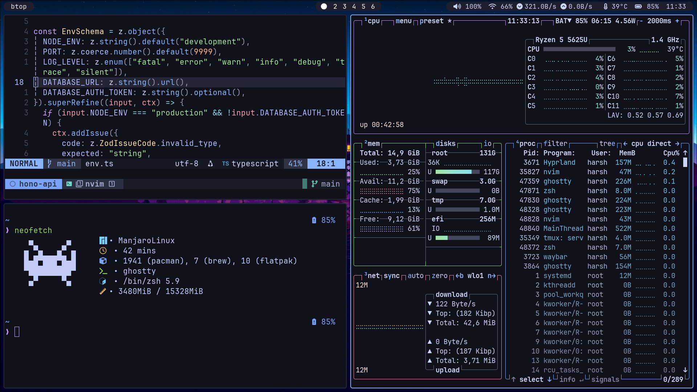
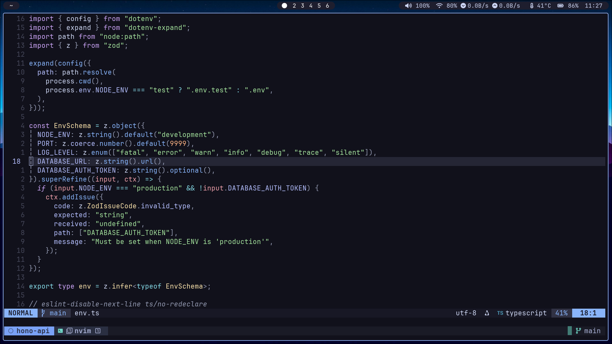
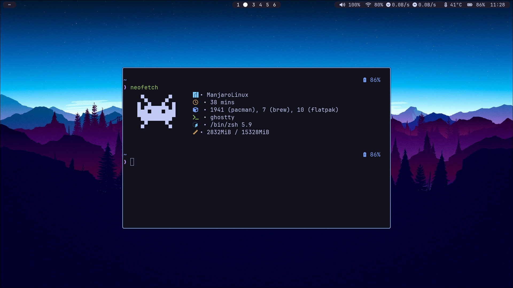

# My Dotfiles

Personal configuration files for a productive Linux development environment with support for both Hyprland (Wayland) and i3 (X11) window managers.





## 🚀 Quick Setup

1. **Clone the repository**

   ```bash
   git clone https://github.com/harsh-m-patil/.dotfiles.git ~/.dotfiles
   ```

2. **Navigate to dotfiles**

   ```bash
   cd ~/.dotfiles
   ```

3. **Install configurations using GNU Stow**
   ```bash
   stow .
   ```

## 📦 What's Included

### Window Managers & Compositors

- **Hyprland** - Modern Wayland compositor with animations
- **i3** - Tiling window manager for X11
- **Picom** - X11 compositor for transparency and effects

### Terminals & Shells

- **Alacritty** - GPU-accelerated terminal emulator
- **Ghostty** - Fast terminal emulator
- **Zsh** - Enhanced shell with custom aliases
- **Tmux** - Terminal multiplexer with custom sessions

### Development Tools

- **Neovim** - Highly configured with LSP, completions, and plugins
- **Starship** - Cross-shell prompt

### System & Utilities

- **Waybar** - Status bar for Wayland
- **Polybar** - Status bar for X11
- **Rofi** - Application launcher and window switcher
- **Dunst** - Notification daemon
- **Ranger** - Console file manager
- **Bat** - Enhanced cat with syntax highlighting
- **Glow** - Markdown viewer

### Theming

- **Catppuccin** theme variants (Mocha, Macchiato)
- **Tokyo Night** theme support
- Custom wallpapers included

## 🛠️ Prerequisites

Before installing, ensure you have:

- GNU Stow
- Git
- Your preferred window manager (Hyprland or i3)

## 📁 Directory Structure

```
~/.dotfiles/
├── .config/          # Application configurations
├── assets/           # Screenshots and images
├── scripts/          # Utility scripts
├── wallpapers/       # Desktop wallpapers
└── .*               # Shell and Git configurations
```

## 🎨 Customization

The configurations are designed to work together but can be selectively applied:

- Each application config is in `.config/`
- Scripts for automation are in `scripts/`
- Themes can be easily switched between variants

## 📝 Notes

- Configurations are optimized for a development workflow
- Includes both Wayland (Hyprland) and X11 (i3) setups
- Tmux sessions are pre-configured for different tech stacks
- Neovim setup includes comprehensive plugin management
